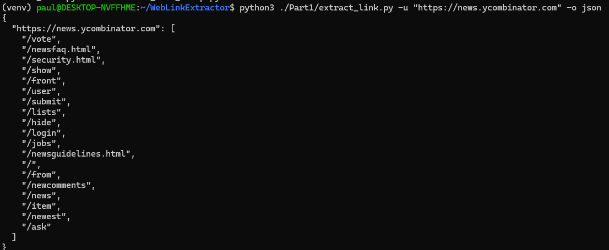
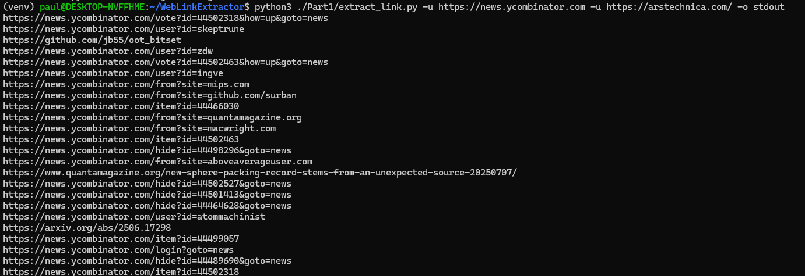
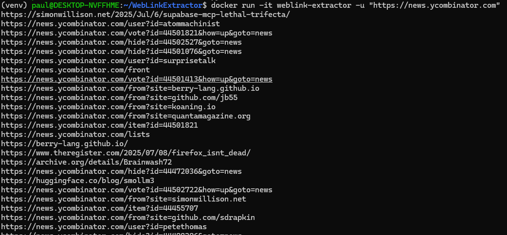
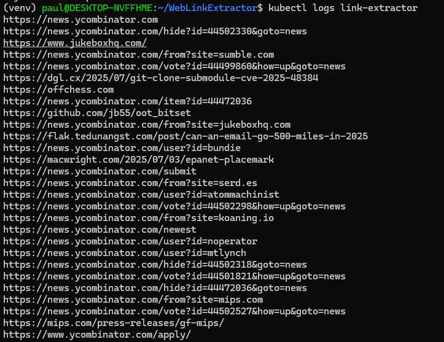
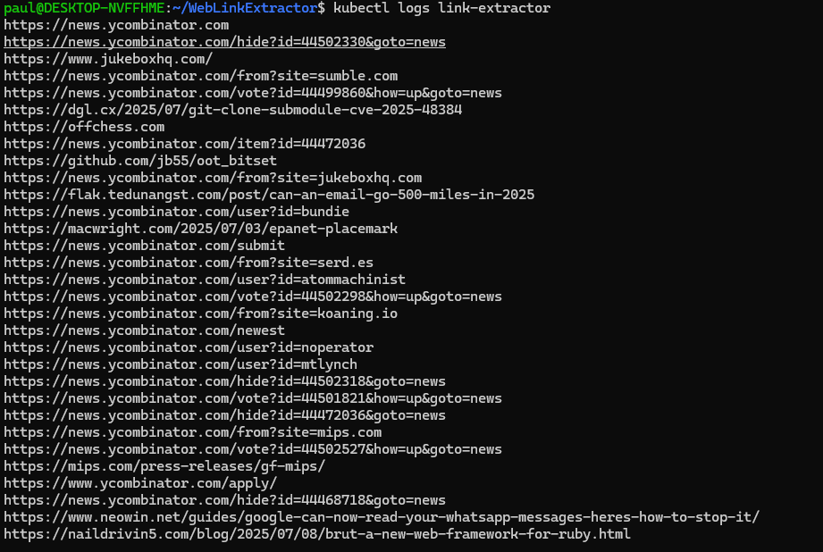
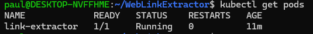
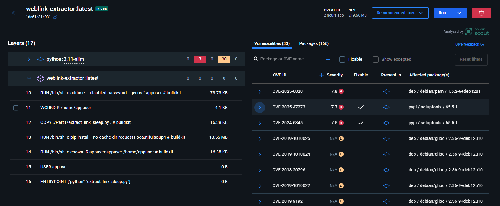

# WebLinkExtractor


## Installation
```bash
git clone https://github.com/votre-utilisateur/web-link-extractor.git
cd web-link-extractor
python3 -m venv venv
source venv/bin/activate
pip install -r requirements.txt
```
## Local Usage
With a single URL:

```py
python3 ./Part1/extract_link.py -u "https://news.ycombinator.com" -o json
```

    

Or even multiple URLs:  

```
python3 extract_links.py -u https://news.ycombinator.com -u https://arstechnica.com/-o stdout
```
    

## Docker Deployment
```sh
docker build -t weblink-extractor .
docker run -it weblink-extractor -u "https://news.ycombinator.com"
```


## Kubernetes Deployment

```sh
minikube start
minikube image load weblink-extractor:latest
kubectl apply -f ./Part2/pod.yaml
```

To view the logs
```sh
kubectl logs link-extractor
 ```
  

Since we added a sleep to keep the container alive, we can see that the pod is still running even after all the links have been extracted:  
  

## Security Scan
Using Docker Desktop, we can scan the image for known vulnerabilities.

   


# Part 3 : Ideal CI/CD
## Source Code Management 
Git provider: GitHub / GitLab / Bitbucket

Branch strategy:
- main: stable production-ready code
- dev: development and testing
- Feature branches: short-lived for specific features or fixes

## Continuous Integration
This phase is automatically triggered on each push or pull request.
###  Linting and Code Quality
- Use tools like flake8, black, pylint to enforce style and detect issues early.
- Run these automatically to fail fast if something is wrong.
### Unit tests
- Run all unit tests with pytest for example.
- Ensure all edge cases are covered
- Use coverage.py to measure code covera
- Block the pipeline if critical vulnerabilities are found
### Security Scans
- Use SAST tool like semgrep.
- Scan Dockerfile with Trivy for known CVEs
### Docker Build
- Build the Docker image from the Dockerfile
- Push the image to a secure Docker registry

## Continous Deployment

### Deploy to Staging
- Use Kubernetes (kubectl or Helm) to deploy the Docker image in a staging namespace
- Run a health check after deployment

### Deploy to production
- Apply the same Kubernetes manifest to the production namespace
- Tag the image appropriately
- Monitor deployment logs and rollout status
- Ensure rollback mechanisms are available

### Use of Kubernetes Deployment for Resilience
Benefits of using a Deployment:
- Automatic restart of failed pods (`restartPolicy: Always`)
- Error management with `livenessProbe` and `readinessProbe`
- Possibility of rolling update and rollback with `kubectl rollout`
- High availability via replicas (if needed)


# Part 4 
 Here is the results of the commands  
 
